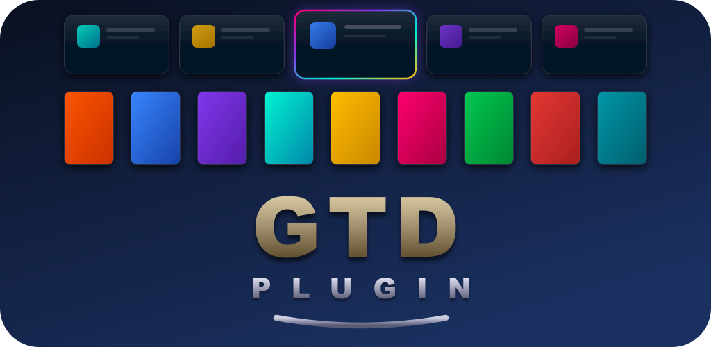
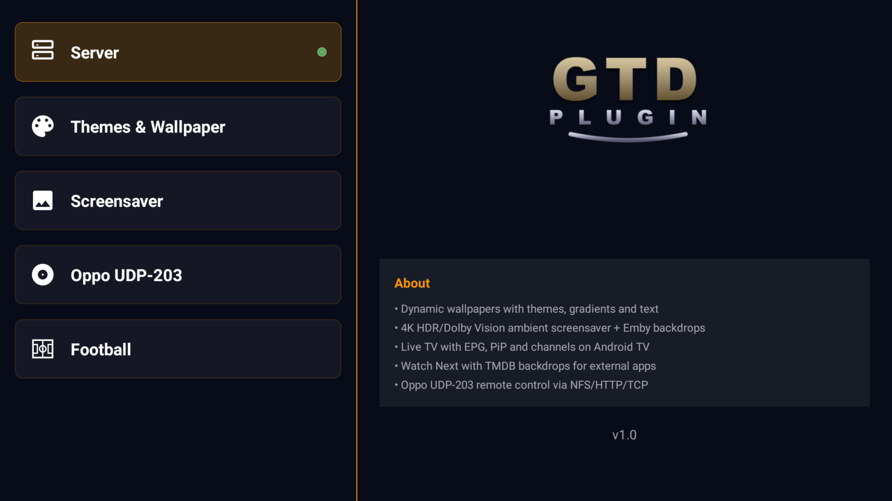
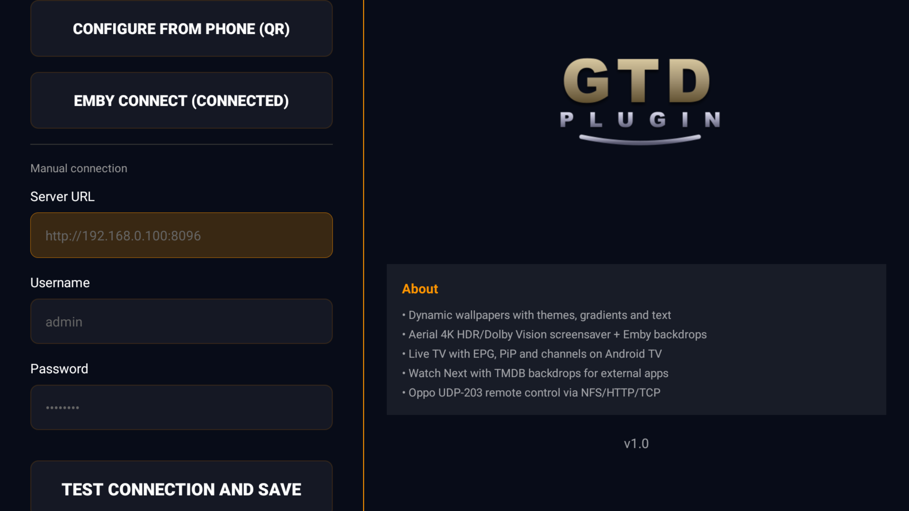
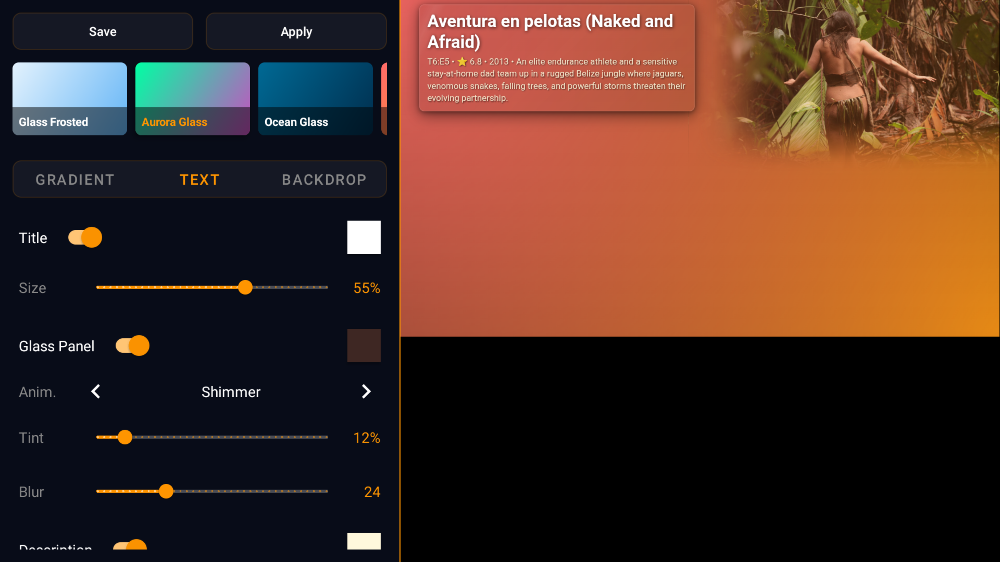
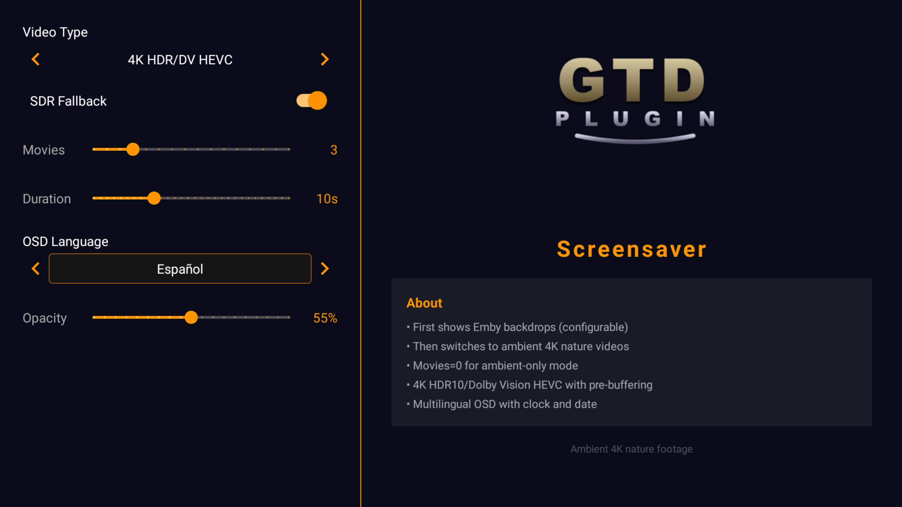
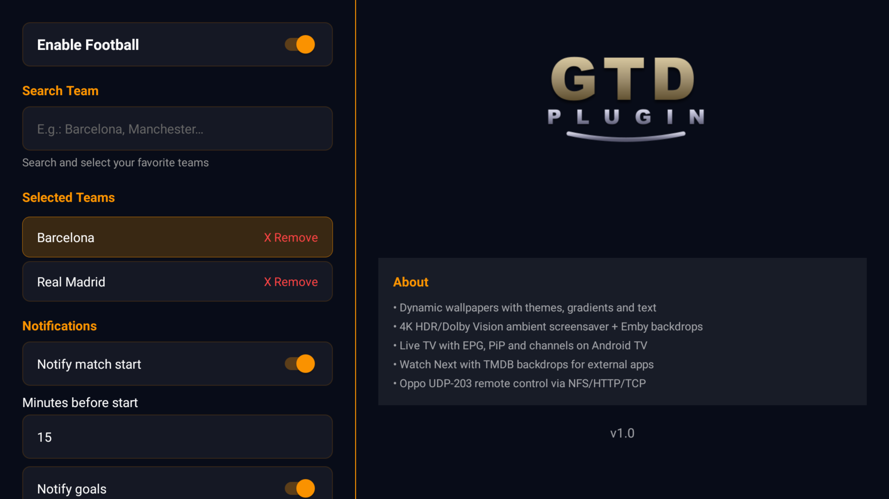
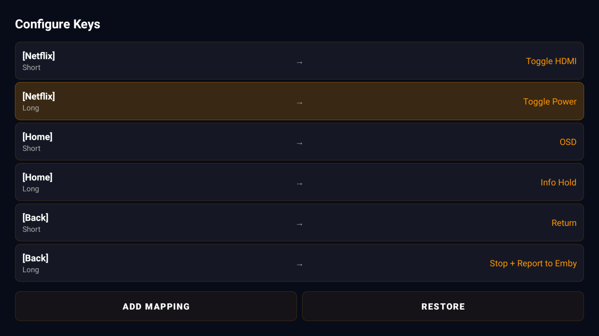
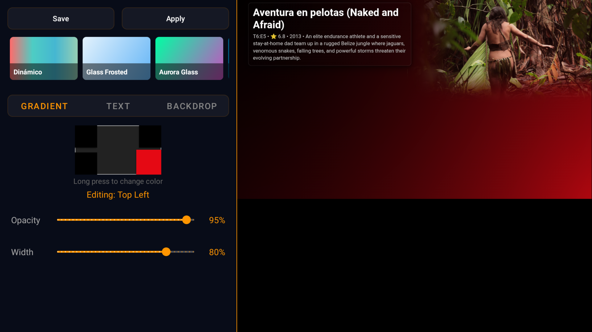
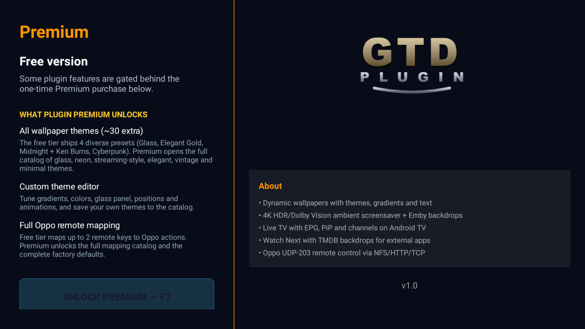

  

# GTD Plugin for Emby

Extends [GTD Launcher](https://github.com/GokuTD/gtd-launcher) with everything that connects it to your Emby server: dynamic wallpapers, an ambient 4K HDR screensaver, native Android TV channels populated from your library, live football overlays, and a built-in Oppo UDP-203 / 205 remote. **Ad-free. No telemetry. No account.**

  
  
  
  

> Built by **GTD TV Studio**. Requires [GTD Launcher](https://github.com/GokuTD/gtd-launcher).

## Screenshots

<table>
  <tr>
    <td></td>
    <td></td>
    <td></td>
  </tr>
  <tr>
    <td align="center">Plugin overview</td>
    <td align="center">Emby connection</td>
    <td align="center">Live theme editor + preview</td>
  </tr>
  <tr>
    <td></td>
    <td></td>
    <td></td>
  </tr>
  <tr>
    <td align="center">4K HDR ambient screensaver</td>
    <td align="center">Football overlays</td>
    <td align="center">Oppo player remote</td>
  </tr>
  <tr>
    <td></td>
    <td></td>
    <td></td>
  </tr>
  <tr>
    <td align="center">4-corner gradient editor</td>
    <td align="center">Premium upgrade</td>
    <td></td>
  </tr>
</table>

---

## Free tier — what you get without paying

- **Connect to any self-hosted Emby server** (URL + login or Emby Connect with PIN)
- **4 wallpaper themes**: Glass Frosted · Elegant Gold · Midnight + Ken Burns · Neon Cyberpunk
- **Ambient 4K HDR screensaver** — cinematic nature footage + your own Emby backdrops
- **Native Android TV channels**: Continue Watching, Latest Movies, Latest Shows, Live TV with EPG
- **Live TV with PiP** — Picture-in-Picture support from the home screen
- **Football match overlays** — live scores, goal notifications, upcoming match cards
- **TMDB integration** — richer card art (your own free API key)
- **Oppo UDP-203 / 205 remote control** — TCP / HTTP / NFS, works alongside the original Oppo remote
- **Samsung soundbar HDMI input switching** — direct LAN, no internet needed
- 11 fully translated locales

## Premium features

One-time **€7** unlock that opens up:

- **30+ extra wallpaper themes** — covering glass, neon, streaming-style, elegant, vintage, minimal and metallic designs
- **Custom theme editor** — tune gradients, colours, glass panel, positions and animations, save your own themes to the catalog
- **Full Oppo remote mapping** — free tier maps 2 remote keys to Oppo actions, premium unlocks the full mapping catalog and the complete factory defaults

No subscription. No recurring charges. Reinstall and Premium restores from your Google account automatically.

---

## What you'll need

| | |
|---|---|
| **Android TV** with [GTD Launcher](https://github.com/GokuTD/gtd-launcher) installed and set as Home |
| **Self-hosted Emby server** reachable on your LAN |
| (Optional) **TMDB API key** — free at [themoviedb.org/settings/api](https://www.themoviedb.org/settings/api) |
| (Optional) **football-data.org** + **api-football.com** keys — both have free tiers |
| (Optional) **Oppo UDP-203 / 205** for the disc-player remote feature |
| (Optional) **Samsung soundbar with IP Control** for HDMI switching |

The plugin works with Emby alone; everything else is opt-in via the Settings panel.

---

## Install

### Google Play Store

> 🟡 Pending Play Store approval. Status will be linked here as soon as the listing goes live.

### Sideload (free APK)

1. Download the latest `GTDPlugin-release.apk` from [Releases](https://github.com/GokuTD/gtd-plugin/releases).
2. Allow unknown sources on your TV: Settings → Security → Unknown apps.
3. Install via [Solid Explorer](https://play.google.com/store/apps/details?id=pl.solidexplorer2) / [X-plore](https://play.google.com/store/apps/details?id=com.lonelycatgames.Xplore) / `adb install GTDPlugin-release.apk`.

The sideloaded APK runs in **free mode** until you purchase Premium via Google Play (the in-app purchase reconciles via the Play Billing client and unlocks the full feature set).

### Mobile companion

For easier setup (Emby login, API keys, IP addresses) install **GTD Setup** on your phone — paired by QR code from the launcher's Setup wizard. Available from the [GTD Launcher releases](https://github.com/GokuTD/gtd-launcher/releases).

---

## Support

- **Bugs / feature requests** → [open an issue](https://github.com/GokuTD/gtd-plugin/issues/new/choose)
- **Email** → gokukinto@gmail.com
- **Privacy Policy** → https://gokutd.github.io/gtd-policy/

This repository hosts the public-facing README, screenshots, releases and issue tracker. The application source is closed; the repo contains no code.

---

© 2026 GTD TV Studio · All rights reserved
